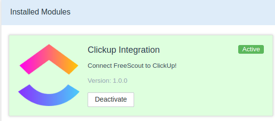
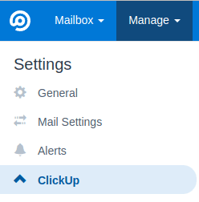
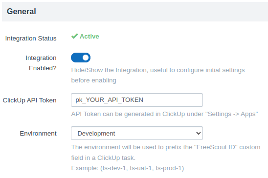
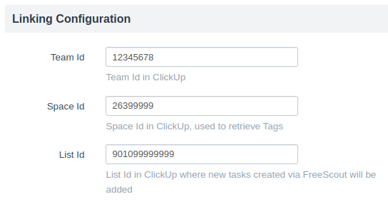
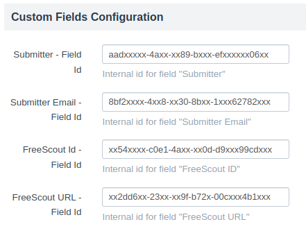
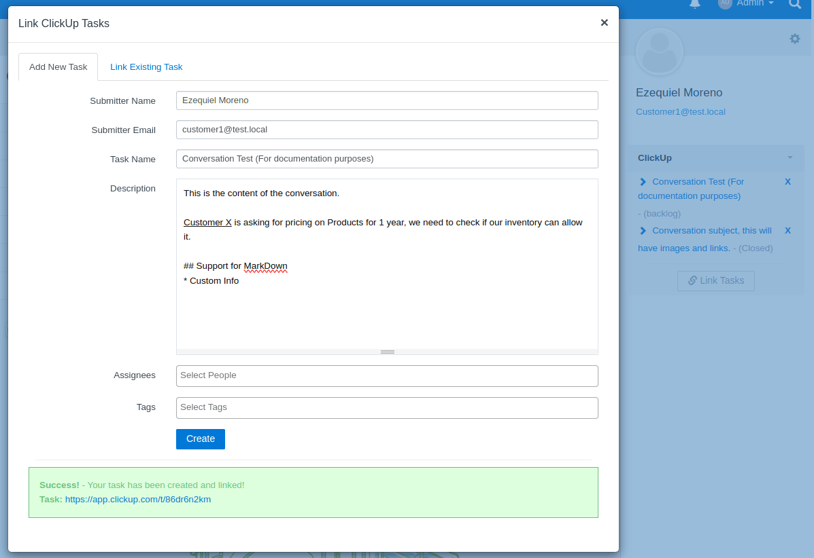
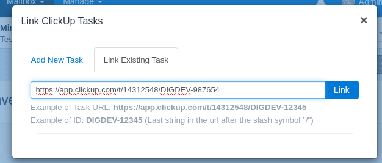
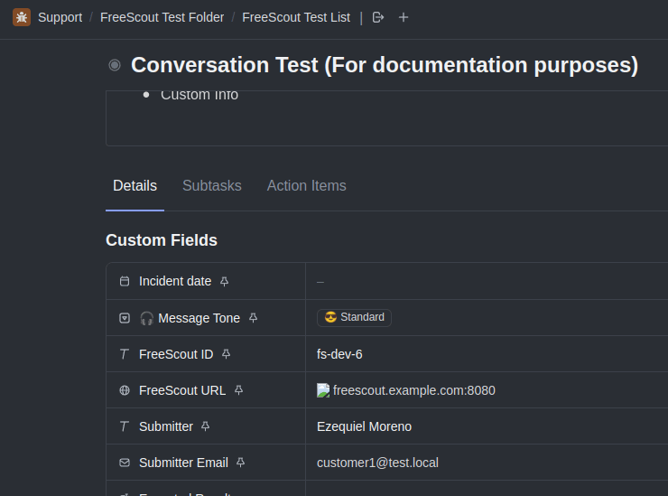

# freescout-clickup-module
---

## Summary

FreeScout Module that allows to Link a Mailbox Conversation to one or more ClickUp Task.

This implementation works in stateless mode, meaning it doesn't store ClickUp references in any way but it creates/retrieves the information via API calls.

**Linking Conversation can be done in 2 ways**:

1. Creating a Task via a FreeScout Conversation
2. Linking an existing ClickUp Task to the Conversation via its URL or Task Id/Custom Id

## Setup

1. Fork this repo and clone it inside your FreeScout **Modules** directory.

2. On FreeScout, enable the Module at **Manage** -> **Modules**

3. Go to **Manage** -> **Settings** -> **ClickUp**

## Configuration

### General

* **Integration Status** (readonly)
  * Shows wheter your integration is Active or Inactive (*Your ClickUp API Token communicating with ClickUp API*)

* **Integration Enabled**
  * Disabled by default, toogle to Enabled after configuring all settings

* **ClickUp API Token**
  * API Token can be generated in ClickUp under **Settings** -> **Apps**

* **Environment**
  * The environment will be used to prefix the "FreeScout ID" (see [Custom Fields Configuration](#custom-fields-configuration)#**FreeScout Id - Field Id**) custom field in a ClickUp task.
    * Example: (fs-dev-1, fs-uat-1, fs-prod-1)
    * You can customize your environments at `Config/config.php`

**Preview**:

### Linking Configuration

Linking configuration defines  **Team** -> **Space** -> **List** where new Tasks will be created, but also the tags to retrieve from the **Space** to be optionally added to the Tasks.

* **Team Id**
  * Team Id in ClickUp
    * It is used to retrieved linked Task with the usage of custom fields

* **Space Id**
  * Space Id in ClickUp
    * It is used to retrieve Tags from ClickUp

* **List Id**
  * List Id in ClickUp
    * It is used for Task creation

**Preview**:

### Custom Fields Configuration

Current module implementation requires that you create **4 Custom Fields** at the target ClickUp List.

* **Submitter - Field Id** (Text field)
  * This field sets the name of the Submitter
* **Submitter Email - Field Id** (Email field)
  * This fields sets the email of the Submitter
* **FreeScout Id - Field Id** (Text field)
  * This field sets an unique identifier for the Conversation and the Task, that way it can be retrieved inside a Conversation.
* **FreeScout URL - Field Id** (URL field)
  * This field sets the full URL to the conversation where it was created/linked so you can navigate back and forth

**Note**: After creating your custom field you can get their corresponding **Id** from the [ClickUp GetAccessibleCustomFields Endpoint](https://clickup.com/api/clickupreference/operation/GetAccessibleCustomFields/)

**Preview**:

### Usage

Once you access to a new Mail Conversation you will see a side-bar container with the ClickUp Tasks that have been linked, these tasks can also be unlinked if needed.

There are 2 ways to Link Tasks to a Conversation:

##### 1. Adding New Task

By default it will automatically fill information based on the Conversation Submitter, Title and Content.

* **Task Name**, **Description**, **Asssignees** and **Tags** are part from the Task's main information.

* **Submitter Name** and **Submitter Email** are part of the Custom Fields for the Task.

**Preview**:

##### 2. Link Existing Tasks

You can specify any Task full URL or only its Id/Custom Id when linking.

**Note**: Linking a Task only sets the **FreeScout URL** and **FreeScout Id** as part of the Custom Fields, the **Submitter Name** and **Submitter Email** are ommited as it is an already created Task.

**Preview**:

#### ClickUp Task Preview

### Limitations

* Current implementation aims to add new Tasks to only 1 specific List
  * In ClickUp you can have your Tasks in 1 single List and create your own rules to route them anywhere in your Spaces
* ClickUp API v2 does not currently support the following:
  * Partial searches for Tasks on either Title or Description, that's why we need use a paste url/Task id to link an existing Task:
    * Public Request: [Using API Get Tasks to search by Title](https://clickup.canny.io/public-api/p/using-api-get-tasks-to-search-by-title)
  * You can only set Assignees as People and not Teams when creating Tasks
    * Public Request: [API call for assigning Teams](https://clickup.canny.io/public-api/p/api-call-for-assigning-teams)

### TODOS

- [ ] Add conversation attachments when adding a new Task